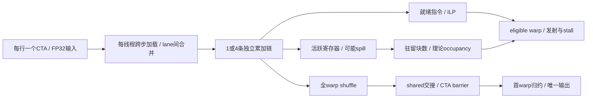

# 2026-09-20 GPU 体系结构：Thor SM110 行归约的依赖链与寄存器预算

## 工业场景

双相机视觉编码器输出 FP32 `[2,197,4097]`，展平为394行，每行物理stride=4100（末尾3个NaN填充）。归约每个token的特征得到 `[394]`，供后续健康监控使用。当前接口是sum，不偷偷改成mean、FP16或近似归约。输入约6.46 MB，预分配设备内存；部署关注P95和共享GPU时的抖动。教学验收目标是正确性通过、最终候选在同一Thor上P50/P95均不退化；没有设备实测就不设置虚构毫秒指标。

本次核心：**同一warp内部的指令级并行（ILP）与寄存器占用影响的驻留warp数量**。以行归约承载体系结构问题，不重复昨日的转置/bank padding。固定执行Thor SM110；今天对照Ampere A100 SM80的整数warp归约指令，昨日对照Hopper。

## 概念回顾

机器人视觉链路中的行归约看似只有加法，却同时受单线程依赖和多线程调度约束。一个线程跨步读取若干特征时，单个累加器的下一次加法必须等待上一次结果。即使访存已经合并，调度器也不能把有真实数据依赖的指令任意并发发射。将工作分到四个独立累加器，最后再合并，可以暴露更多就绪操作；这改变浮点结合顺序，但不改变每个输入恰好参与一次的数学契约。它增加了活跃值，因此也可能增加寄存器需求。

寄存器按线程分配，再受块级分配粒度和SM资源共同约束。多几个寄存器可能跨过驻留块数的台阶，减少可用于隐藏访存等待的warp；编译器还可能把局部数组标量化，或者在压力过高时溢出到local memory。源代码里写了四个变量，既不能直接推出四个物理寄存器，也不能推出更高吞吐。理论occupancy表示资源允许的驻留比例，实际活跃warp和可发射warp还受网格规模、数据依赖及执行阶段影响，必须分别观察。

本练习让一个CTA独占一行，每个warp先交换寄存器求和，再由shared memory交接给首个warp。shuffle只负责warp内寄存器交换，不能替代跨warp的块屏障。尾行和尾列中的线程以零贡献继续参加集合操作，避免掩码与真实参与者不一致。两行小网格即使寄存器很少，也可能只占用极少SM；增大block不能自动解决任务数量不足。公平比较应固定输入、容限和同步边界，先验证每行结果，再结合寄存器、spill、eligible warp及未挂profiler的计时决定是否保留优化。

## 知识图谱



前置条件：block为128或256，整warp参与；输入有限且形状合法；输出不与输入别名。CPU仿真验证索引和浮点树，不能验证GPU的屏障、PTX汇编或寄存器分配。ILP、occupancy、带宽利用率、端到端时延是不同量，不能互相替代。

## 编码练习

唯一25分钟任务：在已给出的 `partial<Acc,Threads>` 中研究累加器数量这一设计点。0–5分钟运行CPU合同检查并定位单链；5–15分钟对照 `Acc=1/2/4/8`，解释 `base+j*Threads` 为什么保持合并且不重复；15–20分钟运行边界验证；20–25分钟在Thor运行对照并填写[验收记录](results/acceptance.md)。Mac用户完成同源CPU检查、读资源/采集命令，把设备列保留未验证，不用CPU计时代替GPU结果。代码已完整提供，无需额外实现一份量化练习。

| variant | kernel模板实例 | 定位 |
| --- | --- | --- |
| 0 | `row_reduce<1,128>` | 正确性和性能基线：单链 |
| 1 | `row_reduce<2,128>` | 两链对照 |
| 2（默认/最终候选） | `row_reduce<4,128>` | 完整优化候选，收益未验证 |
| 3 | `row_reduce<8,128>` | 压力对照，可能增加spill/减少occupancy |
| 4 | `row_reduce<4,256>` | 保留四链、改变block大小的资源对照 |

所有版本读相同输入、写相同输出、使用相同屏障和容限。多累加器减少循环携带依赖，不减少必要的输入字节。若收益退化，保留日志并在部署时选择实测更稳的版本；默认候选不等于生产最优配置。

源码在实现前实际通过GitHub raw阅读（2026-09-20）：

- [pytorch/pytorch](https://github.com/pytorch/pytorch)，tag `v2.8.0`，[Reduce.cuh 的 thread_reduce_impl](https://github.com/pytorch/pytorch/blob/v2.8.0/aten/src/ATen/native/cuda/Reduce.cuh#L519)：PyTorch通用张量归约中的多累加器、尾部与最终combine。保留依赖拆分思路；去掉TensorIterator、多输出向量化、跨CTA归约和泛型算子。这里是受其机制启发的独立实现，不是PyTorch源码移植。
- [NVIDIA/cuda-samples](https://github.com/NVIDIA/cuda-samples)，tag `v12.8`，[reduction_kernel.cu 的 warpReduceSum / reduce7](https://github.com/NVIDIA/cuda-samples/blob/v12.8/Samples/2_Concepts_and_Techniques/reduction/reduction_kernel.cu#L65)：原场景为数组并行求和；保留warp到block两级汇总，改为一CTA一行和独立inline PTX。原文件头为BSD三条款；本次不拷贝第三方源码。`master`旧路径返回404，改读可验证tag；v12.8只作为源码版本，**本课编译器仍要求CUDA13+和SM110**。

## 文件说明

- [src/reduce.hpp](src/reduce.hpp)：host/device线程内累加、形状、独立FP64 oracle、CPU集合操作仿真。
- [src/row_reduce.cu](src/row_reduce.cu)：五个实例、真实inline PTX、RAII、GPU精度与公平计时、occupancy查询。
- [src/cpu_check.cpp](src/cpu_check.cpp)：输入覆盖、尾部、零值、正负抵消及非法形状。
- [CMakeLists.txt](CMakeLists.txt)、[run.sh](run.sh)：CPU/GPU隔离构建与SM110硬约束。
- [profile.sh](profile.sh)、[export-isa.sh](export-isa.sh)、[OPTIMIZATION.md](OPTIMIZATION.md)：ncu教程和真实ISA导出。
- [每日GPTQ原生API示例](quantization/gptq/README.md)：固定commit二阶误差补偿与自定义真实INT4打包；运行未验证。
- [来源记录](results/sources.json)、[验证状态](results/verification.json)、[环境](results/environment.json)：可归档证据。

## 编译与运行

在EveryDay项目根目录执行；需要CMake3.20+、C++17编译器。无依赖安装或模型下载。

```bash
sh systems_practice/2026-09-20/run.sh cpu
sh systems_practice/2026-09-20/run.sh sanitize
# 以下仅在匹配JetPack的Thor SM110上执行
sh systems_practice/2026-09-20/run.sh gpu --sweep
sh systems_practice/2026-09-20/run.sh gpu --all
sh systems_practice/2026-09-20/run.sh gpu --all --small
sh systems_practice/2026-09-20/profile.sh 2
sh systems_practice/2026-09-20/export-isa.sh
```

CUDA13.0 / PTX9.0引入 `sm_110` 名称。经官方归档核实的参考组合是JetPack7.0、Jetson Linux38.2/38.2.1、CUDA13.0.0；这是参考基线，不声称最新版本或板端实际安装版本。使用该JetPack配套驱动，勿以桌面驱动版本号自行替换板端包。[JetPack版本依据](https://developer.nvidia.com/embedded/jetpack/downloads/archive-7.0)。ncu2025.3加入CUDA13支持；实际采集能力还须验证具体设备、驱动和权限。[ncu发行说明](https://docs.nvidia.com/nsight-compute/ReleaseNotes/index.html)。

## 正确性验证

主机严格检查1≤rows≤4096、1≤cols≤65536、cols≤stride≤65544；设备端只接收已验证Shape。测试45个形状×3种数值模式×5种配置，共675比较。宽度含1、31/32/33、127/128/129、255/256/257、1023/1024/1025、4097，含只有一行与3列NaN padding。每个有效输入恰好访问一次，输出每行只有thread0写。NaN污染输出防漏写。

FP64 oracle按原始行顺序累加；所有版本使用 `abs(error) <= 2e-5 + 2e-6*sum(abs(input))`，避免正负抵消时相对误差除零。此容限针对本课有限值数据合同，不宣称覆盖任意动态范围。CPU Release和ASan/UBSan均通过；GPU需执行 `--sweep` 和 `compute-sanitizer --tool memcheck` / `--tool racecheck`（命令见优化文档）才能验收。

## 性能分析

同一输入、20次预热、100次采样，GPU event记录单kernel区间。E2E另做20预热+100次：pageable主机内存H2D→launch→D2H→同步，buffer已预分配；不含输入生成、分配、模型其他层或传感器时延。Thor共享物理内存不代表cudaMemcpy/API成本为零。输出P50/P95及有效字节GB/s，后者并非DRAM流量实测。

重点查 `partial` 的load→add依赖、寄存器数和local bytes，再观察实际eligible warp和stall；`--small`只发两个CTA，专门检验低网格并行度。重复输入可能驻留缓存，不能将所得带宽直接当作冷DRAM带宽。只用未附加ncu的计时判断收益。详细指标、源码关联、潜在热点和架构对照见[OPTIMIZATION.md](OPTIMIZATION.md)。CPU、GPU、NPU和整模型E2E没有混记；本课没有NPU执行路径。

## 实际运行结果

[Release日志](results/cpu.txt)与[ASan/UBSan日志](results/sanitize.txt)：均实际编译、675比较通过、4个非法Shape拒绝、NaN输出拒绝。这是CPU合同仿真结果，无性能替代数据。

[GPU构建](results/gpu.txt)：实际尝试失败，缺nvcc。ncu与ISA导出分别缺ncu/nvcc（[采集日志](results/profile.txt)、[反汇编日志](results/isa.txt)）。因此SM110编译、执行、GPU精度、寄存器数、occupancy、PTX/SASS产物、性能与功耗均未验证；仅生成完整候选代码和命令。非固定后缀的构建请求被[CMake校验拒绝](results/wrong-arch.txt)。

GPTQ本地浅克隆失败，固定commit网页实现已读，完整原生调用示例已交付；缺checkout、torch、transformers、numpy与Thor，运行未验证。今天只重试一次AWQ backlog，仍失败，见[原始重试记录](quantization/awq-retry-source.json)。

## 工程注意事项

所有CUDA构建、运行和ISA命令固定 `sm_110`，不用专属后缀。结构体按值传入kernel；buffer/event禁止复制，异常通过RAII释放，清理失败也报告。CUDA API与launch错误均检查。运行时要求CC11.0，并记录驱动API/Runtime版本和SM数量；这些不等于完整驱动包版本，需要额外保存板端系统记录。

不要给首warp减少参与mask却从未参与lane读取值；不能把shuffle当shared memory fence。不要为提升occupancy直接设 `maxrregcount`，先查是否发生spill。没有冷缓存控制的微基准只对应重复输入工况；实际服务还要固定电源模式、温度和并发任务，记录而不由脚本擅自改设备配置。构建缓存和二进制只在被忽略的build目录。

## 工业故障与面试追问

下列为待Thor复核的排障案例，不是本机实测故障结论。

| 触发条件 | 现象 | 根因假设 / 最小诊断 | 修复与取舍 |
| --- | --- | --- | --- |
| 四链改八链 | 延迟升高且eligible warp变少 | ptxas寄存器或spill增加；对照LaunchStats/Occupancy和local访问 | 降低Acc或block大小，以实际P95选型 |
| 尾列线程提前return | 部分shape挂起或错值 | 集合参与者不一致；racecheck/synccheck及小尾块复现 | 零贡献参与shuffle/barrier |
| 两行小Batch | 理论occupancy高但SM忙碌比例低 | 网格仅两CTA，资源上限不能创造任务 | 保留延迟结果；拆行需额外归约，另行评估launch成本 |
| 正负大数抵消 | 不同变体位级结果不同 | 浮点结合顺序变化；FP64/L1容限定位 | 使用误差合同；更严格精度需要改变累加方案并重新公平比较 |

面试追问（基础→实现→边界→权衡）：

1. 数据依赖如何限制同一个warp中的指令发射？
2. 多累加器为什么可能降低occupancy，源码变量数等于寄存器数吗？
3. 理论驻留warp、活跃warp、eligible warp分别回答什么问题？
4. 为什么行尾没有数据的lane仍要参加shuffle和CTA barrier？
5. 只有两行时扩大block和拆成多个CTA各有什么代价？
6. 如何识别stall采样所在指令只是等待加载结果的消费者？

## 自测问题

在同一Thor上，四链版本寄存器增加、理论occupancy下降，但大网格P95下降；两行网格P95却上升。你会收集哪些互相独立的证据来解释两个结果，并如何决定工业服务的默认配置？
