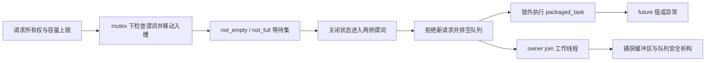

# 2026-09-21 · C++17 并发：有界背压与可排空关闭

## 工业场景

双相机视觉编码器把 FP32 特征 `[2,197,32]` 送入 CPU 请求调度器，再接推理后处理。本期用同形状的 CPU checksum 代替业务回调以隔离并发组件，**没有实现或测量 GPU/NPU 推理**。四生产者/四工作线程用于正确性压力测试；性能采用一个生产者、两个工作线程、每批128个请求。

目标：等待队列不超过容量，成功接受的请求恰好执行一次；关闭拒绝新请求并排空已接受请求；业务异常由 future 返回，资源由 RAII 释放。服务新鲜度预算示例为2 ms，但 C++线程池不提供硬实时保证。本机结果只回答 CPU 调度成本和拥塞，不包含相机采集、传输或加速器时间。

## 概念回顾

有界线程池的关键不是多创建几个线程，而是为请求定义可验证的接受点与结束点。生产者持有队列互斥锁，只有观察到未关闭且存在空槽，才能把任务所有权移入环形缓冲区；这一刻才算接受成功。队列满时进入条件变量等待，消费者取走任务后通知空间可用。通知只是让等待者重新竞争锁，并不保存一个必定属于它的空槽，所以必须在同一把锁下反复检查谓词。互斥锁的释放与随后获取负责发布任务数据，条件变量本身不能代替共享状态的保护。

背压必须与关闭协议一起设计。关闭操作在锁下改变状态，再唤醒等待任务和等待空间的两类线程。生产者醒来后返回关闭，消费者则继续取出已有任务，直到关闭且队列为空才退出。队列为空仍可能有回调正在执行，因此关闭不等于完成，最终需要拥有线程的对象逐一等待退出。任务必须在队列锁外执行，否则慢推理、重入提交或异常处理会把整个服务串行化，甚至形成等待环。

超时限定的是等待入队的预算，不是请求的执行截止时间；本例在已有空槽时允许立即接受，哪怕传入时刻已过。想保证动作新鲜度，还要在执行前检查帧的业务截止时间。绝对时间使用单调时钟，避免每次唤醒重新计算相对超时而延长等待。异常由任务包装器写入结果状态，调用方通过获取结果观察失败；析构阶段先关闭再等待，使任务捕获的缓冲区活到最后一次访问结束。容量限制的是等待队列，工作线程中的任务和生产者尚未入队的对象仍占内存；吞吐变高也不代表请求尾延迟更低。

## 知识图谱



- 主机制：有界队列背压；耦合机制：mutex/CV 的谓词等待、关闭与生命周期。前置条件是对象存活、每个共享状态都用同一锁保护、任务最终返回。
- `push` 的接受点是锁内写槽；`close` 的线性化点是锁内设置状态。因此与关闭竞争的请求只有“已经接受、必须执行”或“返回关闭”两种结果。
- `pop` 返回空代表“关闭且没有待取任务”，不代表其它 worker 已完成。`shutdown` 才等待所有 worker。
- 语言层：C++17 定义锁的同步、谓词等待和线程 join；不保证 FIFO 唤醒、公平性或实时调度。库层：本机 libc++ 210106 的 `wait_until(pred)` 在超时后再次检查谓词，pthread 支持层调用 `pthread_cond_wait/timedwait`。OS 层：Linux 常见 futex 等待路径与 macOS pthread 实现不同，今天没有追踪内核调用；硬件层的原子操作及缓存一致性也不是 CV 的完整语义。不能把 Linux futex 当作 C++标准接口。

## 编码练习

**唯一编码任务，25分钟：给已接受但过期的帧补上执行前的新鲜度检查。** 完整线程池和所有基础测试已提供，不要求重写整个线程池。

1. 5分钟阅读 `BoundedQueue::push/pop/close` 与 `pool_contracts` 的门闩案例，识别“入队超时”和“业务截止”之间的缺口。
2. 10分钟在业务提交包装器中捕获独立的绝对业务截止时间；worker 开始业务前检查，过期通过明确的异常或结果状态完成 future，不能丢弃 future 或修改队列排空语义。保留普通请求与业务异常路径。
3. 5分钟用现有 promise 门闩把一个请求压在队列中，构造过期与未过期两种情况；验证过期请求不访问业务 payload、future 必然就绪、关闭依然能返回。不要靠大段 sleep 代替状态同步。
4. 5分钟运行三种验证模式，说明执行前检查依然不能中断已经开始的长任务。自测问题保持在文末且不附答案。

代码默认交付的是完整的“排空关闭 + 可选入队超时”实现。新鲜度检查是本次需动手添加的业务策略，不把它误称为当前已有保证。

源码来源：实际阅读 [LLVM 仓库](https://github.com/llvm/llvm-project)，tag `llvmorg-19.1.7`，读取日期2026-09-21，具体文件 [llvm/lib/Support/ThreadPool.cpp](https://github.com/llvm/llvm-project/blob/llvmorg-19.1.7/llvm/lib/Support/ThreadPool.cpp)，符号 `StdThreadPool::processTasks`、`workCompletedUnlocked`、`wait`、`~StdThreadPool`。原场景是 LLVM 编译工作调度；保留谓词等待、锁外执行、关闭后排空、join 和队列空不等于完成的机制。**本期是受机制启发的独立实现**，有界环形队列、超时与拒绝状态是教学扩展，不是 LLVM 原有背压 API；省略动态扩容、任务分组、嵌套等待时协助执行与线程亲和性。原文件 SPDX 为 Apache-2.0 WITH LLVM-exception，未复制其源码。

GitHub访问过程：web工具两次连接失败，curl DNS失败，raw浏览器地址被客户端阻止；随后 GitHub blob 页面成功显示并实际阅读源代码。不能把最初失败写成“最终未读源码”。详见 [来源记录](results/source-reading.json)。本机 libc++ 头文件是另一个已实际读取的一手实现，用于分层解释，不能冒充 GitHub 拉取结果。

## 文件说明

- 每日两篇论文：[SCULPT 与剪枝后的部署格式](../paper/2026-09-21/README.md)，含复现难度和已运行的独立机制示例。

- [bounded_pool.hpp](src/bounded_pool.hpp)：固定容量队列、RAII 线程池、future 与入队状态。
- [main.cpp](src/main.cpp)：门闩/MPMC/关闭竞争测试及 CPU 时间边界比较。
- [CMakeLists.txt](CMakeLists.txt)、[run.sh](run.sh)：C++17、警告视为错误、Release/ASan+UBSan/TSan。
- [验证状态](results/verification.json)、[正确性日志](results/contracts.txt)、[性能原始输出](results/cpu.txt)。
- 每日独立栏目：[AdaRound：原生 AIMET 使用示例、软硬舍入与 INT4 导出](quantization/adaround/README.md)。它是已写好的额外示例，没有第二个强制编码作业。

## 编译与运行

从 EveryDay 根目录执行；不安装依赖：

```bash
sh systems_practice/2026-09-21/run.sh cpu
sh systems_practice/2026-09-21/run.sh sanitize
sh systems_practice/2026-09-21/run.sh tsan
```

需要 CMake>=3.16、C++17、线程库和对应 sanitizer。CTests 设置45秒超时避免回归挂住；该限制只是测试保险。可在兼容 Linux C++17 工具链运行相同 CPU 命令，今天仅验证 macOS arm64。不要把在 Thor CPU 上编译这个线程池称为 SM110 GPU 验证。

AdaRound 原生 CPU 用法见独立栏目；当前 Python3.9.6 低于上游>=3.10要求，且未安装 torch/AIMET。其 CPU 执行失败证据已保留。Thor参考兼容基线已核实为 JetPack7.0、Jetson Linux38.2/38.2.1、CUDA13.0.0；本日无CUDA kernel，未新增架构对照轮次。所有后续CUDA执行目标仍为SM110。

## 正确性验证

Release、ASan/UBSan、TSan 均实际编译运行通过；sanitizer 无报错不构成对所有线程交错的数学证明。

| 检查 | 证明的局部契约 |
| --- | --- |
| 容量0、worker0 | 拒绝非法构造 |
| 接受/超时/关闭 | 只有接受成功才移动队列元素；拒绝返回无效future |
| 满队列关闭、空队列关闭 | 唤醒生产者及全部消费者，close可重复 |
| pop唤醒与FIFO | 槽位复用和单队列取出顺序 |
| 业务异常、move-only任务 | 异常通过future传播，之后的worker仍能处理请求 |
| 队列空但门闩占用worker | size不能替代in-flight状态；关闭后仍排空接受项 |
| 三种容量各2000请求 | 4生产者/4worker，无丢失/重复，结果归属正确，high-water不超界 |
| 20轮×400次关闭竞争 | accepted集合数量等于executed；accepted+closed=尝试数 |
| RAII与同池重入 | 析构排空、payload释放；禁止递归提交和worker自join |

线程创建中途失败的清理代码已提供，但没有故意耗尽系统线程，故异常注入路径只做代码审查。OS同步原语失败视为不可恢复；不承诺抢救线程损坏状态。

## 性能分析

每种容量预热10批，测量30批，每批128请求；线程池和输入分配在批次计时外，worker数、输入、计算、校验相同。输入跨请求共享只读，不代表真实每帧分配/传输成本。分位数采用排序后nearest-rank；基准未绑定核心、未控制DVFS，依次运行可能受调度与缓存温度影响。

`admission`包含task/future分配、入队与阻塞；`submit_to_start`从调用前到worker开始，包含生产者背压，**不是纯队列驻留时间**。`cpu_work`仅checksum循环。`request_e2e`结束于业务完成，尚不包含future结果发布及调用方消费；`batch`包括创建future、提交全部请求、取得所有结果和正确性检查。没有GPU kernel、NPU设备时间或整机功耗数据。

Linux部署可先用 `perf stat -e context-switches,cpu-migrations,page-faults .../pool_check bench` 看切换，再在允许的环境用 `perf record -g` 和 `perf report` 定位锁/调度成本；这些命令本日未运行。macOS可用Instruments Time Profiler核对热点，同样未采集。公平测量应单独运行 Release，固定调度条件并同时记录接受率、丢弃率和请求年龄，不能只报吞吐。

## 实际运行结果

Mac arm64、Apple clang21.0.0。本次实际输出如下，单位μs：

| 容量 | 批次P50 / P95 | 入队调用P95 | 提交到开始P95 | CPU工作P50 | 请求完成P95 |
| --- | --- | --- | --- | --- | --- |
| 1 | 924.875 / 1191.54 | 13 | 16.625 | 8.791 | 26.625 |
| 8 | 501.458 / 626.084 | 8.75 | 36.458 | 6.875 | 43.75 |
| 64 | 473.292 / 525.042 | 7.375 | 240.542 | 6.375 | 247.333 |

这个样本中容量64的批次更快，但排队使请求P95更高。不能推断“更大的队列总更好”，也不能将checksum结果外推为真实推理延迟。原始数据见 [cpu.txt](results/cpu.txt)，检测日志见 [sanitize.txt](results/sanitize.txt)、[tsan.txt](results/tsan.txt)。

AdaRound：本地源码克隆失败；网页固定commit实现已读；原生API示例已交付；CPU原生示例未运行成功；Thor未验证。标准库独立u4打包检查通过，不等于AdaRound成功。AWQ今日只重试一次，仍因DNS失败留在backlog。

## 工程注意事项

- owner必须在所有调用者结束后销毁Pool；`close`可并发调用，`shutdown`/析构由owner串行执行。对象的析构与任意成员调用重叠是生命周期错误，mutex无法补救。
- 同池worker递归提交和自join抛logic_error。LLVM支持某些分组内协助执行，本期省略，不能照搬其递归等待能力。跨两个线程池互等仍可能死锁。
- 接受失败时调用方的callable可能已移动进临时job并析构；队列的“失败不移动元素”不等于`Pool::submit`保证保留调用者传入的lambda。可重试请求应在上层持有稳定业务数据。
- 队列容量不包含在途worker、暂存在生产者中的请求及调用方保留的future结果；粗略任务数上限须加入这些项。固定槽位减少队列分配，但每个task/future仍可能分配，未实现硬实时内存池。
- `snapshot`仅用于诊断/测试，不能据此在锁外决定能否入队。条件变量允许伪唤醒，notify不是资源计数器，不保证生产者公平性。
- 慢任务必须自行协作退出；C++17线程不能安全强杀。本实现析构等待已接受任务，业务回调永久阻塞就会永久等待。

## 工业故障与面试追问

以下是针对本实现的工程故障模型；表中门闩对应的正确修复路径已在本机验证，未在生产服务复现事故。

| 触发条件 | 现象 | 根因与最小诊断 | 修复/取舍 |
| --- | --- | --- | --- |
| 满队列时只通知消费者关闭 | 服务退出卡在join生产者 | 查看producers_waiting与关闭状态；用门闩卡住worker | 关闭进入两侧谓词并notify_all；拒绝新请求 |
| 以size==0释放输入缓存 | worker访问已释放帧 | 门闩占住已取出的请求；ASan辅助定位 | 以任务所有权与join/future完成管理生命周期 |
| worker锁内执行或同池重入等待 | 低吞吐或等待环 | 单worker+容量1，采集线程栈 | 锁外执行；本例显式禁止同池重入；必要时设计独立协助执行策略 |
| 用wait_for循环重置预算或无限排队 | 控制动作过期，P95升高 | 比较帧年龄、入队等待和worker开始时间 | 单调绝对截止、业务执行前检查；吞吐与丢弃策略必须同时评估 |

面试追问（只列问题）：

1. 条件变量的notify、mutex的发布保证和等待谓词各承担什么职责？
2. `close`与`submit`并发时，如何定义一个明确的接受点？
3. 为什么空队列不能证明没有任务访问payload？
4. packaged_task如何让业务异常被调用者观察，未调用get会怎样？
5. 有界队列为何仍不等于系统总内存有界，阻塞提交的调用方还持有什么？
6. 允许worker递归提交、帮助执行或取消排队任务分别会增加什么证明义务？

## 自测问题

在单worker、容量1的服务里，A已经执行，B已接受但仍排队，C阻塞在入队；此刻owner关闭服务，而A随后抛出业务异常。请画出允许发生的状态转换，说明A/B/C各自的结果与资源释放条件，并分析若把close改为“直接清空队列”会改变哪些可观察契约。
