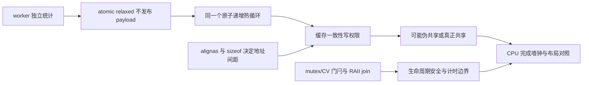

# 2026-09-22 CPU 体系结构：推理统计计数器的缓存争用

## 工业场景

双相机编码器每帧输入 FP16 `[2,197,128]`，由 2～4 个 CPU worker 分片调度。今天只研究每个 worker 的完成计数器：输入是 worker ID 与递增次数，输出是逐 worker 计数及总和，不执行编码器，也不使用 CPU 代替 GPU。计数可供监控读取，不能用于宣布张量已就绪。工程目标是固定内存、无丢计数、无数据竞争，降低高频统计对控制线程的干扰。提供 packed 基线、64/128/256 字节隔离布局及所有线程写同一计数器的诊断对照；默认推荐继续验证 pad128。

## 概念回顾

推理服务中的统计常被看成几乎免费的整数加法。实际情况是，每个工作线程即使写不同变量，也可能争用同一缓存一致性单元。写入通常需要获得相应单元的写权限，邻核已有副本时会发生一致性通信。逻辑上独立的计数器紧邻排列，就可能让写权限在核间反复转移，这称为伪共享。把每个计数器放入具有明确间距的对象，可以减少这种干扰，但会增大工作集，增加监控端扫描成本；间距应由目标机器测量决定，不能把某个库的常量当成硬件事实。

与布局紧密耦合的是原子操作的语义。原子递增保证同一计数器的更新不会相互覆盖，而宽松内存序只放松跨对象的顺序要求，并不取消原子读改写或一致性通信。因此，即便所有操作都是宽松顺序，伪共享仍可成为热点。反过来，对象对齐也不会使普通整数的并发读写自动安全。本例只发布统计数值，不通过计数器传递张量内容；线程开始和结束由互斥量及谓词等待单独协调，存储在线程退出后才销毁。

诊断时要同时观察正确性、布局和测量边界。单线程对照可暴露不同代码路径的开销，多线程隔离布局用于检验争用假设，所有线程访问同一变量则保留真正共享的串行化成本。三者必须执行相同次数的原子指令，不能通过少做工作制造收益。计时覆盖放行到全部工作完成，包含唤醒与调度；不包含线程创建。汇编说明编译器实际发出了什么，硬件计数器才有机会解释等待原因。未经绑定核、隔离负载和频率控制的结果是本机观察，不能据此宣称确定的指令周期或生产端到端收益。

## 知识图谱



前置：C++ 对象布局、原子与数据竞争、条件变量谓词。不要混淆缓存行、原子宽度、分配器对齐和操作系统页大小。C++ 保证原子性、布局约束和线程同步；具体缓存协议及调度属于硬件/OS。macOS 本次未取得缓存行查询权限，也未获取一致性事件计数。

## 编码练习

**唯一任务，25 分钟：为 pad128 增加每 worker 每 64 次批量上报。** 使用线程私有整数累积，达到 64 才 `fetch_add`，退出时刷新尾数；其余三种布局保留作为对照。约 5 分钟定义可见性契约，12 分钟实现，8 分钟验证和测量。允许运行中读者看到最多每 worker 63 次尚未上报的完成数；最终统计必须精确。不得把它用于 payload 就绪、计费确认或严格实时截止判断。

验收：每 worker `0,1,63,64,65,10003` 次，1/2/8 worker，退出尾数正确；TSan 通过。比较优化前后同样的最终计数与计时区间，说明原子操作数变化及监控时效代价。不要把循环完全删掉或把计时移到工作完成之后。现成代码已经提供完整的布局优化候选，批量上报作为本次唯一待做改动。

## 文件说明

- [counters.hpp](src/counters.hpp)：packed 与隔离布局、访问边界和 reset 契约。
- [hot_loop.cpp](src/hot_loop.cpp)：所有版本共用的递增函数。
- [main.cpp](src/main.cpp)：启动/结束门闩、RAII join、检查和基准。
- [源码记录](results/source.json)、[验证](results/verification.json)、[真实 ARM 汇编](results/hot_loop.s)。
- [ARM 架构与边缘端高性能编程补充](ARM_EDGE.md)：NEON/SIMD、数据布局、编译分析与多核调度，衔接本期原子计数与缓存争用。
- [每日 AutoRound 原生 API 栏目](quantization/autoround/README.md)。
- [今日两篇论文与现成示例](../paper/2026-09-22/README.md)：REAL-Q 与 ESTS。

实际阅读 [facebook/folly](https://github.com/facebook/folly) 的 `main`（2026-09-22），文件 [folly/lang/Aligned.h](https://github.com/facebook/folly/blob/main/folly/lang/Aligned.h) 中 `aligned<T,Align>`、`cacheline_aligned`，及 [folly/lang/Align.h](https://github.com/facebook/folly/blob/main/folly/lang/Align.h) 中 `has_extended_alignment`、`hardware_destructive_interference_size`、`cacheline_align_v`。原场景是基础类型包装与跨平台对齐。保留显式对齐和平台条件意识，省略通用转发/类型特征/ABI 兼容宏；本代码是**机制启发的独立实现**，未复制 folly 类。该版本源头 Apache-2.0。尤其原文件对部分平台将 cacheline alignment 降到 max alignment，不能无条件套用其别名并宣称实现缓存隔离。旧 tag URL 和本地 curl 失败详情在 source.json。

## 编译与运行

项目根目录，无额外依赖：

```bash
sh systems_practice/2026-09-22/run.sh cpu
sh systems_practice/2026-09-22/run.sh sanitize
sh systems_practice/2026-09-22/run.sh tsan
```

环境：macOS Darwin 25.6.0 / arm64，Apple clang 21.0.0，CMake 4.4.3，C++17。`run.sh` 默认 CPU 基准；sanitize/tsan 只做正确性，不把插桩性能混入基准。目标 CPU 必须支持无锁 uint64 原子，否则代码明确拒绝性能解释。Linux 可使用同一 CMake 工程，但性能须重新实测。

## 正确性验证

45 个并发试验涵盖 1/2/8 worker × 0/1/10003 次 × 五种模式；分别校验每个槽和总和、reset、实际地址对齐与步长。额外检查非法 worker 数、索引、uint64 模回绕。worker 范围检查在建队前完成，热循环不抛异常。启动失败时 Team 析构将 stop 置位、唤醒并 join 已创建线程；此路径已检查，尚未做线程创建失败注入。读者运行中 sum 只是跨槽近似快照，不能当作某一原子时刻的总量。

## 性能分析

固定每 worker 200000 次，5 次预热、30 次采样，逐轮轮换布局顺序；同一个 `increment` 函数与相同 relaxed 原子操作。P50/P95 使用 nearest-rank 第15/29个值。报告放行门闩至收到全部 done 的 CPU 墙钟，包含唤醒/调度/收尾，排除创建、join、分配与结果校验。`ns_per_increment` 是总时间除全体操作数，是吞吐归一值，不是单指令延迟。

潜在瓶颈证据链：packed 随线程数变慢 → pad 布局改善 → 单线程接近 → 支持一致性争用假设；还需要核绑定、频率和计数器确认。true_shared 保留同地址竞争，填充无法消除它。64 与128的差异不能证明某种缓存行宽度。长时间温控、后台负载、P/E 核迁移均可影响结果。

```bash
# 相同编译器默认 arm64 目标，导出真实编译器汇编；非 CUDA PTX/SASS。
clang++ -std=c++17 -O3 -S -fverbose-asm systems_practice/2026-09-22/src/hot_loop.cpp \
  -o systems_practice/2026-09-22/build/hot_loop.s
# macOS 已构建 object 的真实反汇编
xcrun llvm-objdump --disassemble --demangle \
  systems_practice/2026-09-22/build/cpu/CMakeFiles/cache_counters.dir/src/hot_loop.cpp.o
# Linux 可用时先查询事件，切勿照抄其他 CPU 的 raw event code。
perf list
perf stat -r 5 -e cycles,instructions,cache-misses,context-switches \
  systems_practice/2026-09-22/build/cpu/cache_counters bench
```

本次编译器真实生成 `ldadd x8,x9,[x0]`、循环计数 `subs` 与 `b.ne`。`ldadd` 是原子读改写，其实际等待可能来自同址串行化或一致性所有权；`subs/b.ne` 控制重复次数，不凭静态文本给热点周期。平台依赖的 LL/SC 回退不可假定与此代码同成本。本次没有 GPU kernel，ncu/PTX/SASS 和 GPU 架构对照游标不推进。

## 实际运行结果

Release、ASan/UBSan、TSan 均实际编译执行通过；原始输出见 [cpu.txt](results/cpu.txt)、[sanitize.txt](results/sanitize.txt)、[tsan.txt](results/tsan.txt)。

| 布局 | 1 worker P50 us | 2 worker P50 us | 4 worker P50 / P95 us |
| --- | ---: | ---: | ---: |
| packed | 408.833 | 1923.83 | 7872.88 / 9150.75 |
| pad64 | 408.834 | 330.750 | 358.917 / 664.042 |
| pad128 | 408.417 | 336.292 | 343.417 / 410.834 |
| pad256 | 409.292 | 335.917 | 344.208 / 406.375 |
| true_shared | 407.000 | 1937.25 | 5773.25 / 9308.17 |

固定8槽对象：packed 256 B、pad64 768 B、pad128 1280 B、pad256 2304 B（含外层对齐及成员尾填充，来自本次编译）。pad128 相比 pad256 用更少空间，P50接近，作为继续验证候选。没有核绑定、硬件事件、GPU/NPU、模型精度、端到端推理或功耗数据。源码克隆失败不影响本地独立 C++ 代码的验证。

## 工程注意事项

监控线程频繁读独立槽仍会产生真正共享读写；本次基准没有监控读者。批量计数契约必须允许延迟可见。稳定 ID 应和 worker 生命周期绑定，不能在旧 writer 活跃时复用槽。对齐改变 sizeof 和潜在 ABI，不要直接替换持久化文件、网络协议或第三方插件公共结构。reset 只允许写者停止以后；uint64 回绕虽定义良好，仍需业务约定。错误不要吞掉，TSan 不证明所有并发交错都安全。

## 工业故障与面试追问

| 触发 → 信号 | 根因候选 | 最小诊断 | 修复/取舍 |
| --- | --- | --- | --- |
| worker 增多但统计吞吐下降 | 不同槽伪共享 | 固定热循环比较 packed/padded，记录地址 | 隔离槽，付出空间/扫描代价 |
| 对齐后仍慢 | 全部 writer 实际用了同一个 ID | 校验逐槽计数、true_shared 对照 | 修正槽归属；必要时分片汇总 |
| 把 relaxed 计数当张量就绪 | 缺 payload 发布协议 | 审核 happens-before，不依赖偶现通过 | 独立 release/acquire 队列或锁 |
| 退出后漏报或偶发悬空 | 尾数未刷/存储提前释放 | 65 次输入与 TSan、退出路径检查 | flush 尾部，RAII join 后销毁 |

以上是工程排障模式；本次只实测布局性能与计数边界，未声称重现业务事故。

1. relaxed 原子和普通整数的正确性差别是什么？
2. sizeof、alignof 和数组相邻元素地址是什么关系？
3. 为什么只把数组头对齐不一定隔离各槽？
4. `ldadd` 与 LL/SC 循环分别在哪些条件下产生争用？
5. 合并多个 relaxed load 能否得到一致时刻的总快照？
6. 每64次刷新怎样影响异常退出、尾数与监控时效？

## 自测问题

若新增监控线程每次连续读取所有 pad128 槽，并把扫描频率从每秒10次提升到每秒十万次，为什么隔离布局的优势可能缩小？请同时给出一个正确性不变但性能变化的解释，以及能区分调度开销与一致性流量的最小测量方案。
