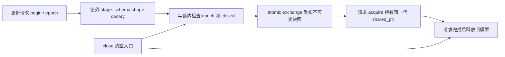

# 2026-09-28 边缘端部署：发布代次与请求快照

## 工业场景

机器人控制头 `[B,8] → [B,1]` 在持续接收请求时更新模型。今天研究部署控制面：新候选先离线校验，成功后发布；一个请求始终持有同一代模型。可运行夹具固定 B=1、FP32、8 个权重，无外部模型，模拟双相机特征已汇总后的动作打分。目标是失败更新不打断旧服务、迟到加载不覆盖新决策、关闭不破坏已接纳请求。真实 TensorRT/RKNN 集成与设备性能仍未验证。

## 概念回顾

模型热更新的主机制是先准备、后发布。加载文件、校验输入形状、构建运行资源和执行金丝雀请求，都应该发生在候选对象上；只有这些步骤成功，服务入口才切换到新对象。这样失败更新不需要把半成品修补回旧状态，也不会让正常请求等待整个加载过程。发布操作还需要一个代次：先开始的加载可能最后完成，若只按完成时间换指针，过时模型就会覆盖新模型。这里每次更新先领取递增票据，发布时在写锁内比较当前代次，拒绝迟到、重复和关闭后的操作。模型版本表示产物身份，票据表示控制操作次序，回滚旧产物也必须获得新票据。

与发布紧密耦合的是请求资源寿命。一个请求取得不可变共享快照后，即使服务入口已经切换，旧权重仍然存在，直到最后一个持有者释放。入口指针的原子交换解决可见性与竞争，引用计数解决存活时间，两者不能互相替代。普通共享指针对象不能一边被直接赋值一边被读取，因此本例统一使用标准库的原子自由函数；这并不保证实现无锁，也不保证请求延迟有实时上界。模型内部可变执行上下文仍须另行隔离，不能因为外层指针可共享就让多个请求共用非线程安全上下文。

关闭只禁止新的获取与发布，已经拿到快照的请求可以完成。旧模型析构放在发布锁外，避免清理阻塞控制锁；真实加速器资源还必须等异步设备工作完成，再由明确的回收线程销毁。主机函数返回并不等于设备完成。今天用同步、不可变的小模型隔离这些控制关系，既能注入坏产物和乱序完成，也能观察关闭边界；后续接入设备时必须增加事件完成、上下文池与内存预算验收，不能直接把本例的引用计数当成设备同步。

## 知识图谱



前置：C++17 RAII、mutex、shared_ptr、异常安全。语言层是 acquire/release 可见性与对象生命周期；标准库可能使用内部锁，OS 调度和引用计数原子开销另计。指针交换、文件持久化、GPU event 完成是三个不同边界。本例仅覆盖第一个。

## 编码练习

**唯一 25 分钟任务：实现可取消的候选发布。** 现成代码为已完成参考。新增 `cancel(ticket)`：仅当 ticket 是当前未发布代次才将其失效，不清空当前服务；过期取消不能影响更新的候选。用一个确定次序案例验证“开始 A → 开始 B → 取消 A → 发布 B 成功”，另一个验证“取消当前 A 后 A 不可发布”。建议阅读 5 分钟、实现 12 分钟、原有与新增边界验证 8 分钟，不另加量化或论文作业。

源码先读 [Triton core](https://github.com/triton-inference-server/core)，`main`，读取 2026-09-28；文件 [model_lifecycle.cc](https://github.com/triton-inference-server/core/blob/main/src/model_repository_manager/model_lifecycle.cc) 的 `GetModel`、`AsyncLoad`、`OnLoadComplete/OnLoadFinal`、`ModelDeleter`。原场景是多版本异步模型服务；保留迟到操作拒绝、就绪后切换与共享寿命关系。此处是**受启发的独立实现**，将时间戳换成票据，省略 backend、版本策略、repository agent、设备异步析构，不复制 Triton 实现。该文件有 NVIDIA BSD 三条款声明；[来源记录](source.json)。最初错误路径 404 已保留。

## 文件说明

- [deployment.hpp](src/deployment.hpp)：候选构建、原子入口、写者控制。
- [main.cpp](src/main.cpp)：失败注入、并发请求及 CPU 控制面基准。
- [CMakeLists.txt](CMakeLists.txt)、[run.sh](run.sh)：编译与 sanitizer。
- [验证记录](results/verification.json)、[Release](results/release.txt)、[ASan/UBSan](results/sanitize.txt)、[TSan](results/tsan.txt)。
- [今日 OmniQuant](../../quantization/2026-09-28/omniquant/README.md)、[ARM03](../../arm/2026-09-28/README.md)、[两篇论文](../../paper/2026-09-28/README.md)。

## 编译与运行

在 EveryDay 根目录运行：

```sh
sh systems_practice/daily/2026-09-28/run.sh release
sh systems_practice/daily/2026-09-28/run.sh sanitize
sh systems_practice/daily/2026-09-28/run.sh tsan
```

Mac 已运行；Linux ARM64/Thor 上同一 CMake 命令可编译控制面，尚未板验，不需 CUDA。实际接入处是 `stage` 内构建后端及金丝雀、`Model::infer` 内借用每请求上下文、完成回调持有快照到设备完成。现有示例没有加载 TensorRT engine 或 RKNN 模型。

[NVIDIA 官方下载页](https://developer.nvidia.com/embedded/jetpack/downloads) 2026-09-28 显示 Thor/T5000、JetPack 7.2.1、Linux 39.2.1、CUDA 13.2.2、TensorRT 10.16.2。它不证明本机、原量化库或 ncu 可用。通用旧 release-notes URL 实际指向 6.2.1，不能拿作 Thor 依据。未来 CUDA 构建仍只用 `sm_110`；今天无 CUDA kernel，不推进 GPU 对照架构游标，也没有 PTX/SASS/ncu 性能结果。

## 正确性验证

实际覆盖：未就绪；7 种坏产物；请求 Shape/非有限输入；空候选；过期票据与重复发布；失败保留当前版；旧请求输出不变及 weak_ptr 失效；关闭幂等、关闭后拒绝与旧请求继续完成。并发测试 4 个 async worker 各 5000 请求、1000 次更新，对每个快照检查权重计算与版本对应。任务异常经 future 传递并等待回收。正确性检查不依赖可被 Release 关闭的 assert。

## 性能分析

20 个预热批次、100 个测量批次，每批 1000 次 acquire 加 8 元素同步夹具推理，steady_clock 计时，报告每请求 P50/P95；输入、输出校验和固定。只测无发布竞争的 CPU 控制路径，不能把它解释成热更新耗时、设备 kernel 时间或请求端到端延迟。引用计数、标准库内部锁、CPU 调度都可能影响结果。目标板验收须另测加载耗时、更新期间请求 P95、旧版最大驻留字节，以及两代模型同时存在的峰值内存；尚无数据。

## 实际运行结果

Mac arm64、Apple clang 21.0.0：Release、ASan/UBSan、TSan 首轮均通过。最终格式化后再次通过，CPU夹具 P50/P95 = 0.00725/0.007292 us/请求（无更新竞争，不是设备或端到端数据）。最终验证数据见 [verification.json](results/verification.json)；所有原始日志均保留。未安装依赖或下载模型。GPU/NPU、真实后端、板端服务和功耗均未验证；没有设备加速或端到端性能结论。

## 工程注意事项

最新请求优先：新候选失败时保留当前服务，但旧加载仍作废。关闭与 acquire 同时发生时，在关闭线性化点之前拿到的快照可以完成；这不是无条件取消已接受请求。`Registry` 的析构必须晚于所有调用者；示例用 futures 显式等待。构造函数公开仅供受信教学夹具使用，生产接入应让发布只接收经过验证的候选类型。

输入 artifact 是内存中的可信测试文本，不含签名、文件原子重命名或断电持久化协议，canary 也不是完整模型精度评测。真实后端的销毁若会等待当前请求线程，应采用受控回收队列，不能直接照搬同步析构。模型可回滚，控制 epoch 不回滚。CPU 标准库合同可移植，不代表 RKNN/TensorRT 上下文线程安全。

## 工业故障与面试追问

| 触发 → 现象 | 根因 | 最小诊断与修复/取舍 |
| --- | --- | --- |
| 慢加载晚到 → 新版被旧版覆盖 | 按完成顺序发布 | 日志同时记录 artifact version 与 ticket；校验当前 epoch |
| 截断/错 Shape 产物 → 切换后请求失败 | 先替换再验证 | 注入错误 manifest 与 canary；锁外完整 stage |
| 入口切换即 free → 在途请求崩溃 | 裸指针跨更新使用 | ASan 与持有旧请求测试；共享快照或显式 lease |
| 设备仍执行时最后引用释放 → 悬空设备资源 | 主机寿命误当设备完成 | 设备 event、完成回调、回收队列；本机未验证该链路 |

面试追问（由浅到深）：

1. artifact version 与发布 epoch 为什么需要分开？
2. 为什么共享引用计数不等于可以并发赋值同一个 shared_ptr？
3. acquire/release 在这里保证哪些写入可见？
4. 一个新候选失败时，应允许旧候选继续发布吗？两种政策的差异是什么？
5. 如何给旧模型驻留时间和内存占用设置上界？
6. 后端析构等待当前工作线程时会发生什么，如何设计回收责任？

## 自测问题

某请求在关闭前取得旧快照，设备工作尚未完成；同时更早开始的加载候选刚返回成功。请画出允许的状态转移、资源释放时点及必须拒绝的发布，并指出仅靠共享指针不能保证的一个设备条件。
